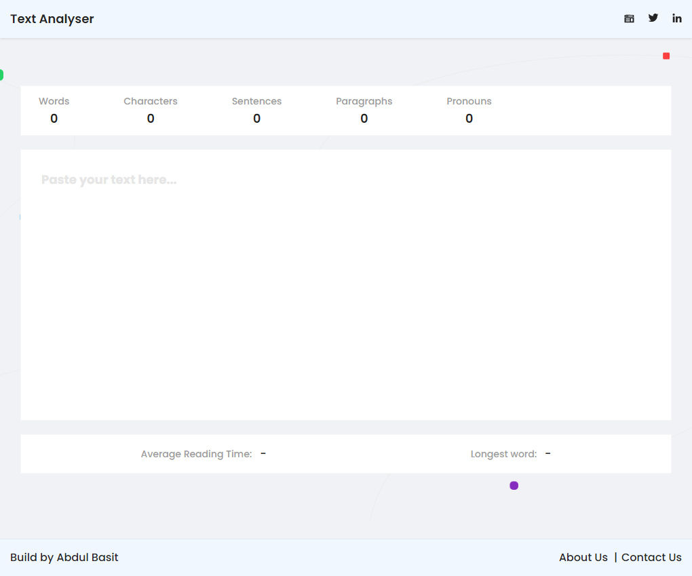

# Practical ReactJS Coding Challenges To Improve Your Business Logic Skills

## Introduction to Text Analyzer Tool Challenge

The text analyzer is the first in the series of ReactJS coding challenges. In this challenge, we have created a text area that calculates some parameters in the typed or pasted Text. The text area should calculate and show the following:

1. Words
2. Characters
3. Sentences
4. Paragraphs
5. Average reading time
6. The longest word in paragraphs
7. Number of pronouns in the Text (list is given)

## How to start

1. Clone this Text Analyzer (reactjs coding challenge) GitHub repo
2. Go to text-analyzer-tool folder
3. Run npm install or yarn to install dependencies
4. Run the server, you will then see the below screen on your local host
5. And you should be good to go



**Objective:** To make each feature of app functional. [This](https://reactjs-text-analyzer.netlify.app/) is a live link of demo app.

### Skills to be Tested:

The challenge requires you to write the logic in Reacjts, and tests you on the following skills:

1. how does Javascript if conditions and loops work?
2. The basics of regular expression (regex)
3. You can work with string and array related tasks/problems.
4. how to work with `useState()`, `useEffect()`, and `useRef()` hooks.

## User Stories for Text Analyzer ReactJS Challenge

Following are the “user stories” that you need to work on and make it functional:

1. **Active text area:** As soon the page load the text area will be active and the cursor will be blinking, we don’t have to click the text area to activate it.

2. **Counting Words and Characters:** It should count how many words and characters are there in the text. Let us do a quick test:

### Quick Test to Count Words and Characters

```
Hello, I  am John.
```

This text contains 4 words and 18 characters. Characters also include white spaces.

3. **Counting Sentences and Paragraphs:** You must output the number of sentences and paragraphs in the Text. It should recognize the sentences using punctuation marks as the sentence ends at (.!?). A paragraph starts from a new line and must contain at least a word.

### Quick Test to Count Sentences and Paragraphs

```
Hello, world! There are many variations of passages of Lorem Ipsum available?

The majority have suffered alteration in some form, by injected humor, or randomized words which don't look even slightly believable.
```

The above text contains 3 sentences and 2 paragraphs.

4. **Counting Pronouns:** You will find a list of pronouns in `src/data/pronouns.ts` file in the form of an array. You have to check how many pronouns have been used in the text. (I only added personal, object, possessive and reflexive pronouns in the file).

In the same way, you can count any desired list of words.

### Quick Test to Check Pronouns

```
How are you?  // 1 pronoun
I am Mike.    // 1 pronoun
You, ok?     // 1 pronoun
That is mine. // 1 pronoun
```

5. **Calculate the Average Reading Time:** Assume the average reading time is 225 words per minute. You have to find out how long it would take to read the given text.

6. **Find Longest Word in the Text:** If multiple longest words have the same length, it should show just the first one. Make sure you also handle edge cases like (.!?,) appear after the longest word.

### Quick Test to Check Longest Word

```
Contrary to popular belief, Lorem Ipsum is not simply random text. It has roots in a piece of classical Latin literature, from 45 BC, making it over 2000 years old.
```

The longest word in the Text is “literature”.

7. The project is created with React and Typescript, so make typescript happy by writing all types.

### Complete Test

When you are done paste the following text into the tool and check if your answer matches.

> Hello, how are you?

> Lorem Ipsum is dummied text of the printing and typesetting industry. Lorem Ipsum has been the industry's standard dummy text since the 1500s when an unknown printer took a galley of type and scrambled it to make a type specimen book.

> It has survived five centuries and the leap into electronic typesetting, remaining essentially unchanged. It was popularised in the 1960s with the release of Letraset sheets containing Lorem Ipsum passages, and more recently with desktop publishing software like Aldus PageMaker including versions of Lorem Ipsum.

The above text contains:

Words: **88**

Characters: **570**

Sentences: **5**

Paragraphs: **3**

Pronouns: **4**

Average Reading Time: **~1 minute**

Longest word: **typesetting**


[Here](https://www.codevertiser.com/reactjs-coding-challenges-to-improve-business-logic/) you can read the intro article of ReactJS Challenges.
