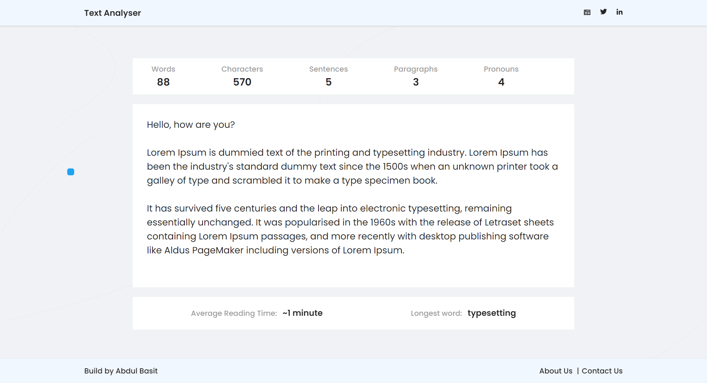
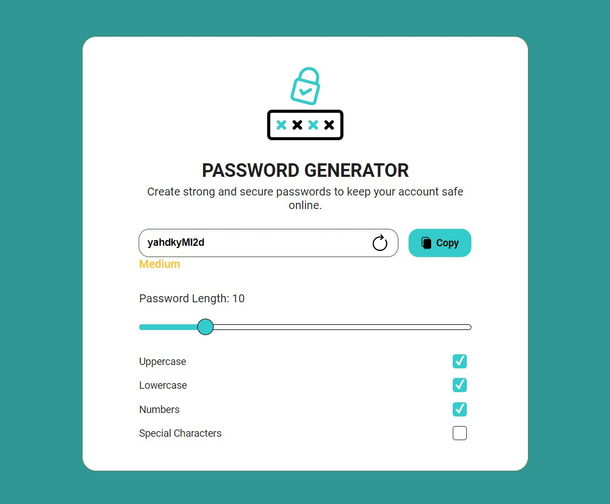
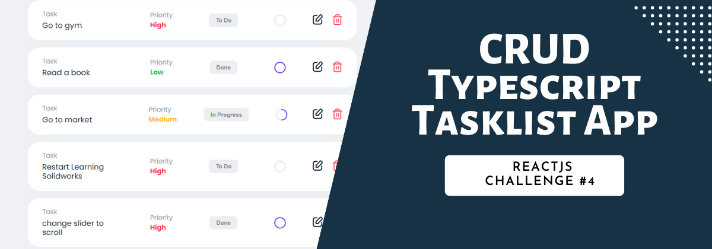

# Free ReactJS Coding Challenges: Build Functionality for Responsive UI

This repository contains a collection of free ReactJS coding challenges designed to help developers improve their ReactJS logic-building skills and create functionality for responsive UI. The challenges are built using **ReactJS with TypeScript.**

| Challenge                                        | Objective                                                             | Description                                                                                       | Demo Link                                                        |
| ------------------------------------------------ | --------------------------------------------------------------------- | ------------------------------------------------------------------------------------------------- | ---------------------------------------------------------------- |
| Challenge #1: Introduction to Text Analyzer Tool | A text area that calculates parameters of the typed or pasted text    | [Challenge Description](https://www.codevertiser.com/reactjs-challenge-1-text-analyzer-tool/)     | [Live Demo](https://reactjs-text-analyzer.netlify.app/)          |
| Challenge #2: React Password Generator           | Logic for generating and validating passwords with specified strength | [Challenge Description](https://www.codevertiser.com/reactjs-challenge-2-password-generator/)     | [Live Demo](https://reactjs-password-generator.vercel.app/)      |
| Challenge #3: React Random Quote Generator       | Fetching and displaying random quotes using ReactJS                   | [Challenge Description](https://www.codevertiser.com/reactjs-challenge-3-random-quote-generator/) | [Live Demo](https://react-random-quote-application.netlify.app/) |
| Challenge #4: CRUD Typescript Tasklist App       | Perform CRUD operations in a tasklist app using React and TypeScript  | [Challenge Description](https://www.codevertiser.com/reactjs-challenge-4-crud-tasklist-app/)      | [Live Demo](https://react-tasklist.vercel.app)                   |

## Who Can Use these ReactJS Coding Challenges?

1. Beginner developers looking for a fun little **frontend coding challenges** to test their **ReactJS logic-building** skills

2. Developers interested in building small tools that they can convert into **micro SAAS**

3. Companies looking for **ReactJS hiring challenges** to assess their candidate's ReactJS coding skills

## List of Reactjs Challenges

All challenges are free. I wanted the challenges to be different and designed them carefully. In each challenge, I have covered different skill sets of JavaScript and Reactjs, from the array to object, the string to regex, and Reactjs hooks.

## Challenge #1: Introduction to Text Analyzer Tool

The text analyzer is the first in the series of ReactJS coding challenges. In this challenge, we have created a text area that calculates some parameters in the typed or pasted Text. The text area should calculate and show the following:

1. Words
2. Characters
3. Sentences
4. Paragraphs
5. Average reading time
6. The longest word in paragraphs
7. Number of pronouns in the Text (list is given)

**Read the Challenge [Description](https://www.codevertiser.com/reactjs-challenge-1-text-analysis-tool/)**

**Objective:** To make each feature of app functional. [This](https://reactjs-text-analyzer.netlify.app/) is a live link of demo app.

## Challenge #2: React Password Generator

This challenge is suitable for beginners as well. In this challenge, you will develop logic for a password generator, including options for creating and validating a password with a specified strength, copying the password, and passwords with desired characters.

**Read the Challenge [Description](https://www.codevertiser.com/reactjs-challenge-2-password-generator/)**

**Objective:** To make a functional app. This is a [live](https://reactjs-password-generator.vercel.app/) link.

## Challenge #3: React Random Quote Generator

Challenge yourself to build a random quote generator using ReactJS and showcase your front-end development skills. Flourish your creativity with this fun code challenge!

This challenge differs slightly from Text Analyzer and Password Generator because you need to fetch data from json-server using Axios.

**Read the Challenge [Description](https://www.codevertiser.com/reactjs-challenge-3-random-quote-generator/)**

**Objective:** To make a functional app. This is a [live](https://react-random-quote-application.netlify.app/) link.

## ReactJS Challenge #4: CRUD Typescript Tasklist App

This React Typescript Tasklist/Todo challenge requires you to perform CRUD operations with instructions to write clean, reusable, manageable, and scalable code.

CRUD refers to create, read, update, and delete. Mastering these operations in Reactjs means you can build any application.

This challenge is different and more challenging than the last three challenges you have completed. If you can complete this ReactJS Typescript Tasklist challenge independently, you can be easily hired as an intern/junior React developer.

This is not just a challenge, but my 3 years of working experience. The tasks you will be performing in this challenge are what a React developer performs daily. So, let's dive in and improve your React development skills!

**Read the Challenge [Description](https://www.codevertiser.com/reactjs-challenge-4-crud-tasklist-app/)**

**Objective:** To make a functional app. This is a [live](https://react-tasklist.vercel.app) link.

## Can you star the ReactJS Challenges GitHub repo?

I love creating free content that helps developers start their jobs and excel in their careers. Each challenge requires a lot of time to create.

First, I brainstorm the challenge idea. Then, I collaborate with a freelance UI/UX designer to design the idea. After that, I convert the design into code and write content for the challenge.

It's a lengthy process that requires time, energy, and resources.

By starring this ReactJS Challenges repository, you will motivate me to create more free content like this.

## Need Help or Working Code?

Ideally, you should finish these challenges on your own regardless of how long it takes, as figuring it out on your own would help hone your skills as a front-end and ReactJS developer. However, you can see hints if you are stuck somewhere in the middle. Hints will give you a better idea about how to write logic.

For working code like you have seen in the demo apps, you can send me an email at basit@codevertiser.com or can reach out to me on [LinkedIn](https://www.linkedin.com/in/abdulbasitprofile/) or [Twitter](https://twitter.com/Basit_Miyanji).

[Here](https://www.codevertiser.com/free-reactjs-coding-challenges-for-responsive-UI/) you can read the intro article of ReactJS Challenges.
